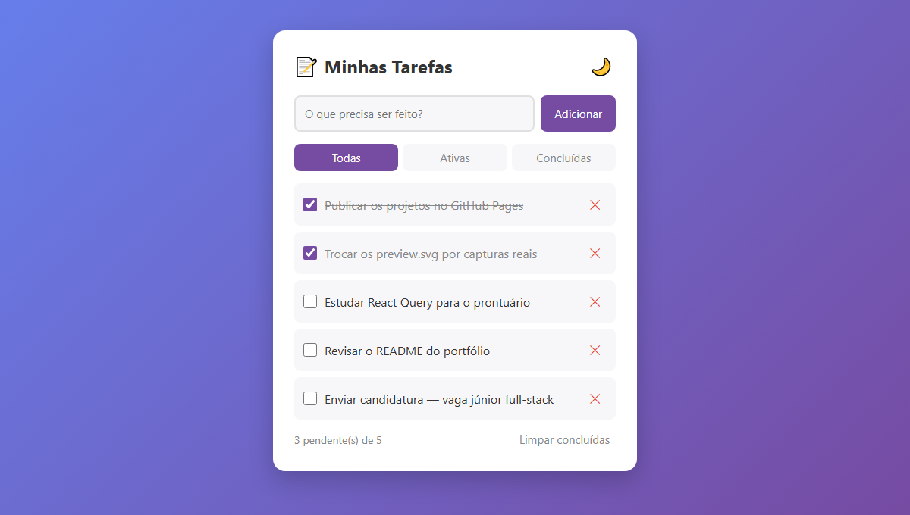

# ✅ Lista de Tarefas (To-Do List)

Aplicação web para gerenciar tarefas, com dados salvos no navegador.

🔗 **Demo ao vivo: [iasminrds.github.io/Lista_tarefas](https://iasminrds.github.io/Lista_tarefas/)**

## ✨ Funcionalidades

- ➕ Adicionar tarefas
- ✔️ Marcar como concluída (checkbox)
- ✏️ **Editar** (duplo clique no texto)
- 🗑️ Remover tarefas
- 🔍 **Filtros**: todas / ativas / concluídas
- 🧹 Limpar todas as concluídas de uma vez
- 🌙 **Modo escuro** (a preferência fica salva)
- 💾 **Persistência com `localStorage`** — nada é perdido ao recarregar

## 🚀 Como executar

Basta abrir o [demo](https://iasminrds.github.io/Lista_tarefas/). Para rodar local, abra o `index.html` no navegador — nenhuma instalação necessária.

## 🛠️ Tecnologias

- HTML5 semântico
- CSS3 com variáveis (temas claro/escuro)
- JavaScript (Vanilla, sem frameworks)

## 💡 Conceitos demonstrados

- Manipulação do DOM
- Eventos e delegação
- Persistência de dados no cliente
- Design responsivo e acessível (ARIA labels)

## 📄 Licença

MIT — veja [LICENSE](./LICENSE).

---

Feito por **Iasmin Ribeiro de Souza** · [LinkedIn](https://www.linkedin.com/in/iasmin-ribeiro-de-souza-033536401) · [GitHub](https://github.com/IasminRDS)
