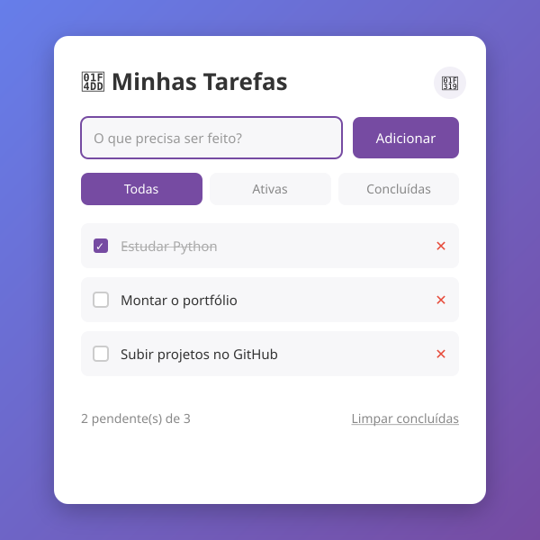

# ✅ Lista de Tarefas (To-Do List)

Aplicação web para gerenciar tarefas, com dados salvos no navegador.

> 💡 A imagem acima é uma prévia da interface. Para um resultado ainda melhor no
> portfólio, substitua `preview.svg` por um **screenshot** ou **GIF** real do app
> em uso (dá para gravar a tela com ferramentas como ScreenToGif ou o próprio
> Xbox Game Bar do Windows: `Win + G`).

## ✨ Funcionalidades

- ➕ Adicionar tarefas
- ✔️ Marcar como concluída (checkbox)
- ✏️ **Editar** (duplo clique no texto)
- 🗑️ Remover tarefas
- 🔍 **Filtros**: todas / ativas / concluídas
- 🧹 Limpar todas as concluídas de uma vez
- 🌙 **Modo escuro** (a preferência fica salva)
- 💾 **Persistência com `localStorage`** — nada é perdido ao recarregar

## 🚀 Como executar

Abra o arquivo `index.html` no navegador. Nenhuma instalação necessária.

## 🛠️ Tecnologias

- HTML5 semântico
- CSS3 com variáveis (temas claro/escuro)
- JavaScript (Vanilla, sem frameworks)

## 💡 Conceitos demonstrados

- Manipulação do DOM
- Eventos e delegação
- Persistência de dados no cliente
- Design responsivo e acessível (ARIA labels)
